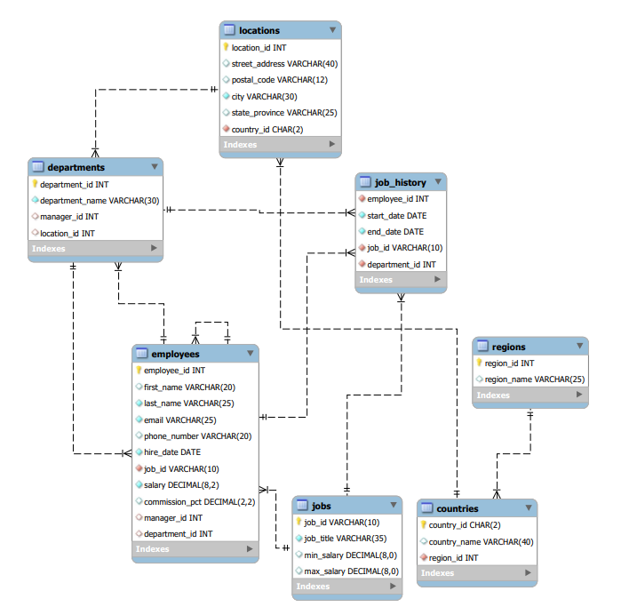

# Simple Spring Boot 3.0.4 JPA Example

### Instruction

1. [Install JDK 17](https://www.oracle.com/java/technologies/javase/jdk17-archive-downloads.html)
2. [Install Gradle 7.6.1](https://gradle.org/next-steps/?version=7.6.1&format=bin)
3. [Install git command line tool](https://git-scm.com/downloads)
4. Set up environment variable: `JAVA_HOME = C:\Program Files\Java\jdk-17`
5. Set up environment variable: `GRADLE_HOME = C:\gradle-7.6.1`
6. Set up environment variable `PATH = %JAVA_HOME%\bin;%GRADLE_HOME%\bin` 
7. [Install MySQL Installer 8.0.32](https://dev.mysql.com/downloads/installer)
8. [Install MySQL Workbench 8.0.32](https://dev.mysql.com/downloads/workbench)
9. [Download and install HR schema](https://github.com/nomemory/hr-schema-mysql/blob/master/hr-schema-mysql.sql)
10. Git Checkout command: `git clone https://github.com/ravibeli/jpa-example.git`
11. Build the project using command `gradle clean build` if you have gradle configured in your local
12. Build the project using command `mvn clean install` if you have maven configured in your local
12. [Install postman](https://www.postman.com/downloads)

### HR Schema Tables Relationship UML Diagram


### API Documentation:

| Entities   | API Title                                                                   | Method | URL                                                                             |
|------------|-----------------------------------------------------------------------------|--------|---------------------------------------------------------------------------------|
| Employee   | Get All Employees Details                                                   | GET    | http://localhost:8080/employees                                                 |
| Employee   | Get Employees By Dept ID                                                    | GET    | http://localhost:8080/employees/20                                              |
| Employee   | Get Employees salary between 4800 and 6000                                  | GET    | http://localhost:8080/employees?minSalary=4800&maxSalary=6000                   |
| Employee   | Get Employees whose salary in range 4800 to 6000 from particular department | GET    | http://localhost:8080/employees?departmentName=IT&minSalary=4800&maxSalary=6000 |
| Employee   | Get Employees whose salary in range 4800 to 6000 from all departments       | GET    | http://localhost:8080/employees?minSalary=4800&maxSalary=6000                   |
| Department | Get All Departments Details                                                 | GET    | http://localhost:8080/departments                                               |
| Department | Get Department By Dept ID                                                   | GET    | http://localhost:8080/departments/20                                            |

#### JPA Specification logic to build multiple AND conditions dynamically based on the input given:

```
    public static Specification<Employee> findByDepartmentNameAndSalaryRange(String departmentName, BigDecimal minSalary, BigDecimal maxSalary) {
        return new Specification<Employee>() {
            @Override
            public Predicate toPredicate(Root<Employee> root, CriteriaQuery<?> query, CriteriaBuilder builder) {
            Join<Employee, Department> departmentJoin = root.join(Employee_.department);

                List<Predicate> predicates = new ArrayList<>();
                if (nonNull(departmentName)) {
                    predicates.add(builder.and(builder.equal(departmentJoin
                            .get(Department_.DEPARTMENT_NAME), departmentName)));
                }
                if (nonNull(minSalary) & nonNull(maxSalary)) {
                    predicates.add(builder.and(builder.between(root.get(Employee_.salary), minSalary, maxSalary)));
                }
                return builder.and(predicates.toArray(new Predicate[0]));
            }
        };
    }
```

#### Above code is JPA Specification logic builds dynamic query that satisfied all the below requirements:

1. Search all the employees from departmentName = IT
    > GET http://localhost:8080/employees?departmentName=IT
2. Search all the employees whose salary range between '4800' and '6000' regardless of all the departments
   > GET http://localhost:8080/employees?minSalary=4800&maxSalary=6000
3. Search all the employees whose salary range between '4800' and '6000' in 'IT' department
   > GET http://localhost:8080/employees?departmentName=IT&minSalary=4800&maxSalary=6000

## Performance and Best Practices of Fetch Types

#### Table scan without: FetchType.LAZY

**Note:** Here without `FetchType.LAZY` unnecessary joins all the tables, and does all columns scan in the SELECT

		select
			e1_0.employee_id,
			e1_0.commission_pct,
			d1_0.department_id,
			d1_0.department_name,
			d1_0.location_id,
			d1_0.manager_id,
			e1_0.email,
			e1_0.first_name,
			e1_0.hire_date,
			j1_0.job_id,
			j1_0.max_salary,
			j1_0.min_salary,
			j1_0.job_title,
			e1_0.last_name,
			m1_0.employee_id,
			m1_0.commission_pct,
			d2_0.department_id,
			d2_0.department_name,
			d2_0.location_id,
			d2_0.manager_id,
			m1_0.email,
			m1_0.first_name,
			m1_0.hire_date,
			j2_0.job_id,
			j2_0.max_salary,
			j2_0.min_salary,
			j2_0.job_title,
			m1_0.last_name,
			m1_0.manager_id,
			m1_0.phone_number,
			m1_0.salary,
			e1_0.phone_number,
			e1_0.salary 
		from
			employees e1_0 
		left join
			departments d1_0 
				on d1_0.department_id=e1_0.department_id 
		left join
			jobs j1_0 
				on j1_0.job_id=e1_0.job_id 
		left join
			employees m1_0 
				on m1_0.employee_id=e1_0.manager_id 
		left join
			departments d2_0 
				on d2_0.department_id=m1_0.department_id 
		left join
			jobs j2_0 
				on j2_0.job_id=m1_0.job_id 
		where
			e1_0.employee_id=?

#### Table scan with: FetchType.LAZY

**Note:** Here with `FetchType.LAZY` only necessary joins tables will happen, and select the columns whichever are required in the SELECT

    select
        e1_0.employee_id,
        e1_0.commission_pct,
        e1_0.department_id,
        e1_0.email,
        e1_0.first_name,
        e1_0.hire_date,
        e1_0.job_id,
        e1_0.last_name,
        e1_0.manager_id,
        e1_0.phone_number,
        e1_0.salary 
    from
        employees e1_0 
    join
        departments d1_0 
            on d1_0.department_id=e1_0.department_id 
    where
        d1_0.department_name=? 
        and e1_0.salary between ? and ?
	
	
## JPA Anti Pattern of findById 
**Reference Document**: https://vladmihalcea.com/spring-data-jpa-findbyid

#### Case-1: Mapper using below findById methods

```
@Mapping(target = "job", expression = "java(jobRepository.findByJobId(employeeDto.getJobId()))")
@Mapping(target = "department", expression = "java(departmentRepository.findByDepartmentId(employeeDto.getDepartmentId()))")
@Mapping(target = "manager", expression = "java(employeeRepository.findByManagerId(employeeDto.getManagerId()))")
```

**Application Logs:**

```
2023-03-16T00:25:06.446+05:30  INFO 15924 --- [nio-8080-exec-1] o.s.web.servlet.DispatcherServlet        : Completed initialization in 1 ms
Hibernate: 
    select
        j1_0.job_id,
        j1_0.max_salary,
        j1_0.min_salary,
        j1_0.job_title 
    from
        jobs j1_0 
    where
        j1_0.job_id=?
2023-03-16T00:25:06.731+05:30  INFO 15924 --- [nio-8080-exec-1] c.hr.app.jpaexample.common.LoggerAspect  : Logging AOP: JobRepository.findByJobId :: Execution time: 127ms
Hibernate: 
    select
        d1_0.department_id,
        d1_0.department_name,
        d1_0.location_id,
        d1_0.manager_id 
    from
        departments d1_0 
    where
        d1_0.department_id=?
2023-03-16T00:25:06.740+05:30  INFO 15924 --- [nio-8080-exec-1] c.hr.app.jpaexample.common.LoggerAspect  : Logging AOP: DepartmentRepository.findByDepartmentId :: Execution time: 9ms
Hibernate: 
    select
        e1_0.employee_id,
        e1_0.commission_pct,
        e1_0.department_id,
        e1_0.email,
        e1_0.first_name,
        e1_0.hire_date,
        e1_0.job_id,
        e1_0.last_name,
        e1_0.manager_id,
        e1_0.phone_number,
        e1_0.salary 
    from
        employees e1_0 
    where
        e1_0.employee_id=?
2023-03-16T00:25:06.758+05:30  INFO 15924 --- [nio-8080-exec-1] c.hr.app.jpaexample.common.LoggerAspect  : Logging AOP: EmployeeRepository.findByManagerId :: Execution time: 17ms
2023-03-16T00:25:06.758+05:30  INFO 15924 --- [nio-8080-exec-1] c.hr.app.jpaexample.common.LoggerAspect  : Logging AOP: EmployeeController.createEmployee :: Execution time: 158ms
```

#### Case-2: Mapper using getReferenceById(id) default method available in JpaRepository interface

```    
@Mapping(target = "job", expression = "java(jobRepository.getReferenceById(employeeDto.getJobId()))")
@Mapping(target = "department", expression = "java(departmentRepository.getReferenceById(employeeDto.getDepartmentId()))")
@Mapping(target = "manager", expression = "java(employeeRepository.getReferenceById(employeeDto.getManagerId()))")
```

**Application Logs:**
```
2023-03-16T00:36:26.032+05:30  INFO 53336 --- [nio-8080-exec-1] o.s.web.servlet.DispatcherServlet        : Completed initialization in 1 ms
2023-03-16T00:36:26.206+05:30  INFO 53336 --- [nio-8080-exec-1] c.hr.app.jpaexample.common.LoggerAspect  : Logging AOP: JpaRepository.getReferenceById :: Execution time: 35ms
2023-03-16T00:36:26.211+05:30  INFO 53336 --- [nio-8080-exec-1] c.hr.app.jpaexample.common.LoggerAspect  : Logging AOP: JpaRepository.getReferenceById :: Execution time: 3ms
2023-03-16T00:36:26.216+05:30  INFO 53336 --- [nio-8080-exec-1] c.hr.app.jpaexample.common.LoggerAspect  : Logging AOP: JpaRepository.getReferenceById :: Execution time: 3ms
2023-03-16T00:36:26.216+05:30  INFO 53336 --- [nio-8080-exec-1] c.hr.app.jpaexample.common.LoggerAspect  : Logging AOP: EmployeeController.createEmployee :: Execution time: 49ms
```

